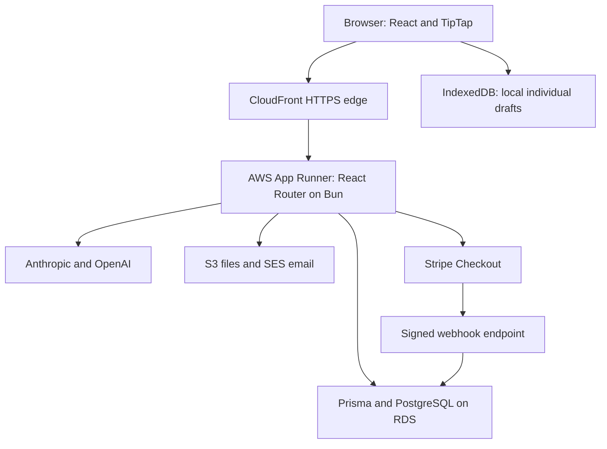

# Yawp platform: a step-by-step tech stack walkthrough

Research ticket: `yawp-tech-stack-walkthrough`  
Inspected: September 3, 2026  
Source baseline: `0466e5981d86ce534ca36370002f08d5a1e86767`

This describes the implementation and configuration in the checked-out repository. It is a research deliverable, not a live production audit. Package versions below are manifest declarations; deployed versions and enabled features can differ. Application behavior was not changed.

Yawp is a full-stack TypeScript writing platform. React provides the screens; React Router runs both the web pages and server endpoints; PostgreSQL stores the school, assignment, writing, and feedback records. The server connects to AI providers, payments, email, and file storage.

The infrastructure diagram follows the checked-in production configuration. Preview environments use a separate hosting arrangement described below.

## 1. Repository, language, and runtime

The repository is a Bun workspace. `services/web-app` contains the application, `packages/prisma` contains the shared database schema/client, and `infra` contains Terraform infrastructure definitions. TypeScript supplies static types across the browser and server code.

The root manifest pins Bun 1.3.1 and declares Node 22 or newer. These have distinct roles: the production Docker image and startup script run the application with Bun; the project management CLI uses Node. The web manifest declares React 18, React Router 7, Vite 5, Tailwind 3, and TypeScript 5.7 ranges.

Sources: [root manifest](../../package.json), [web manifest](../../services/web-app/package.json), [Dockerfile](../../services/web-app/Dockerfile), [startup script](../../services/web-app/start.sh), [project CLI](../../bin/project).

## 2. Screens and navigation

React renders the teacher, student, and administrator interfaces. Tailwind supplies styling utilities; Radix provides UI primitives such as dialogs and menus. Vite handles development and the build pipeline.

React Router discovers routes from files and has server rendering enabled. A route can contain its screen plus server-side data loading and form handling. This keeps much of the frontend and backend together in one application rather than requiring a separately deployed API for every screen. Zod and form libraries provide validation tools at input boundaries.

Sources: [route discovery](../../services/web-app/app/routes.ts), [server-rendering configuration](../../services/web-app/react-router.config.ts), [Vite configuration](../../services/web-app/vite.config.ts), [web manifest](../../services/web-app/package.json).

## 3. Authentication and organization access

The inspected password login path checks a bcrypt password hash and creates a database `Session`. A signed, HTTP-only cookie carries the session identifier. Subsequent requests resolve the user through that session.

Authentication answers who the user is. `OrgMembership` answers which organization they are acting in and whether they are a teacher or student. Server helpers resolve active membership, owner/admin privileges, and applicable student-license requirements. Resource-specific access checks then determine which documents or classes that user can read or change. Organization feature settings also govern available workflows.

Cognito packages appear in dependencies, but the inspected login implementation uses the application's own password/session flow; a dependency entry does not establish the active authentication architecture.

Sources: [authentication helpers](../../services/web-app/app/utils/auth.server.ts), [cookie storage](../../services/web-app/app/cookie-session-storages/authentication.server.ts), [schema](../../packages/prisma/schema.prisma).

## 4. Database and core product model

Prisma maps typed application queries to PostgreSQL using its PostgreSQL driver adapter. Checked-in migrations evolve the database schema. Production infrastructure declares an AWS RDS PostgreSQL instance.

The main conceptual relationships are:

- A `User` has organization memberships; organizations contain schools and configuration.
- Classes connect teacher and student memberships.
- Assignment types and rubrics define writing activities; assignments are attached to classes through `ClassAssignment`.
- `Document` stores writing, while `DocumentRevision` and `DocumentWriteJournal` support history and save diagnostics.
- `Submission`, grading runs, comments, and activity records represent submitted work and feedback.
- Collaboration, student licenses, and AI logs have their own persisted records.

These distinctions matter: editing a draft, submitting it, and grading it are different operations with different records and access rules.

Sources: [Prisma schema](../../packages/prisma/schema.prisma), [database client](../../services/web-app/app/utils/db.server.ts), [infrastructure](../../infra/main.tf).

## 5. Individual writing and saving

TipTap, built on ProseMirror, provides the rich-text editor. The individual-document persistence hook captures HTML and plain text, saves a local draft in IndexedDB, and schedules server synchronization. IndexedDB is browser storage, not the shared database.

`SyncService` posts to `/api/document/:id/save`. The server resolves user and membership access, records the write attempt, checks supplied revision information, updates the document, and creates revision snapshots when appropriate. The client tracks pending, successful, and failed saves, with retry handling. This separates immediate typing from the network round trip; a local draft alone does not mean the server has accepted it.

Sources: [editor persistence hook](../../services/web-app/app/routes/app_.documents_.$id/document-editor/use-editor-sync.ts), [browser draft store](../../services/web-app/app/utils/document-store.ts), [sync service](../../services/web-app/app/utils/sync-service.ts), [save endpoint](../../services/web-app/app/routes/api.document.$id.save/route.ts).

## 6. Collaborative writing

Group documents use TipTap with Yjs, which represents edits in a form that can be merged across participants. The implemented `CollabHttpProvider` batches outgoing updates and polls Yawp endpoints for other participants' changes. Its defaults are 250 milliseconds for outgoing batching and one second for polling; those are configuration defaults, not guaranteed end-to-end latency.

Presence and cursor information are handled separately from the permanent document update log. The schema includes collaboration updates, authors, presence, and group membership. The active editor imports this HTTP provider; the Hocuspocus dependency does not mean the inspected implementation requires a hosted WebSocket service.

Sources: [collaborative editor](../../services/web-app/app/routes/app_.collab-documents_.$id/collab-editor.tsx), [HTTP provider](../../services/web-app/app/domain/collaboration/http-provider.ts), [schema](../../packages/prisma/schema.prisma).

## 7. AI tutoring, grading, and insights

Server endpoints assemble the relevant document, assignment instructions, rubric, and conversation context before requesting an AI response. The shared completion layer integrates Anthropic and OpenAI, supports tool calls, and records request metadata, timing, token counts, and—in full logging mode—payloads in `LlmLog`.

The inspected tutoring/grading code and production configuration use `claude-sonnet-4-6` as the default model. Model choice can be overridden. The completion layer supports an OpenAI outage fallback, defaulting to `gpt-4o-mini`, subject to configuration, client availability, and per-call restrictions. It also supports metadata-only logging and disabling provider fallback for individual workloads.

For example, a tutor request validates the request and access, builds rubric/document context, calls the model, and returns feedback. A grading request is a separate workflow; the model is a service used by Yawp's application logic, not the database or access-control system.

Sources: [tutor route](../../services/web-app/app/routes/api.domain.tutor-response/route.ts), [grading route](../../services/web-app/app/routes/api.domain.grade-essay-ai/route.ts), [completion layer](../../services/web-app/app/utils/getLLMCompletion/getLLMCompletion.ts), [infrastructure model setting](../../infra/main.tf).

## 8. Payments, files, email, and analytics

Stripe Checkout handles the UA student purchase flow. Server-side license logic creates payment sessions and reconciles verified webhook events into student-license state. The webhook validates the Stripe signature; loading a success page alone is not the payment authority. Billing is scoped through the configured UA organization and feature settings.

S3 stores files and videos, with signed download URLs and multipart upload support. Email can use SES or Resend; the production Terraform configuration selects SES. React Email supplies email components. PostHog is integrated for analytics, including browser initialization when a key is configured.

Sources: [student licensing](../../services/web-app/app/domain/student-license/student-license.server.ts), [Stripe webhook](../../services/web-app/app/routes/api.stripe.webhook/route.ts), [S3 service](../../services/web-app/app/services/s3.server.ts), [email helper](../../services/web-app/app/utils/email.server.ts), [application root](../../services/web-app/app/root.tsx), [infrastructure](../../infra/main.tf).

## 9. Hosting and deployment

Terraform describes the production AWS stack: Route 53 DNS, ACM certificates, a CloudFront HTTPS edge, an App Runner container service, RDS PostgreSQL, S3, IAM permissions, and Secrets Manager references. The configured CloudFront default behavior disables caching for the application requests. App Runner uses `/api/healthcheck` for health checks.

Docker packages the built application; ECR stores the image. The deployment workflow runs on pushes to `main`, validates migrations, applies production migrations, and pushes the production image. App Runner is configured for automatic deployments. This is repository configuration evidence, not confirmation that any particular commit is currently live.

PR previews use an EC2 host with Docker Compose projects, per-PR databases in shared PostgreSQL, and a custom HTTPS ingress/access gate. Their lifecycle and runtime differ from production App Runner.

Sources: [Terraform](../../infra/main.tf), [deployment workflow](../../.github/workflows/deploy.yml), [preview runbook](../runbooks/preview.md), [Dockerfile](../../services/web-app/Dockerfile).

## 10. Development and verification

`./bin/project` is the supported entry point for runtime checks, isolated local setup, fixtures, development servers, selected tests, and QA preparation. Local worktrees use dedicated PostgreSQL containers and ports.

Bun runs unit and integration-oriented tests. React Router type generation plus TypeScript checks route/application types. Playwright exercises browser workflows, with axe available for accessibility checks. GitHub Actions also checks migrations and deployment/preview tooling. The existence of a test file is not proof that every CI job runs it; inspect the selected profile or workflow for exact coverage.

Sources: [agent contract](../../AGENTS.md), [project CLI](../../bin/project), [web scripts](../../services/web-app/package.json), [CI workflow](../../.github/workflows/ci.yml).

## Putting the pieces together

A typical student journey crosses these boundaries in order:

1. The browser requests a page through the configured HTTPS edge.
2. React Router resolves the session and organization membership, loads permitted data through Prisma, and renders the React interface.
3. The student types in TipTap. For an individual draft, IndexedDB stores local work and the sync service sends saves to the application.
4. The server checks access/revision state and persists accepted content in PostgreSQL.
5. A tutor request sends relevant context through server-side AI code; the response returns to the interface.
6. Submission and teacher feedback use the submission/grading records and their own server workflows.

The major engineering boundaries are therefore browser state, server authorization/business rules, durable database state, external services, and deployment infrastructure. Each solves a different part of the writing-platform workflow.
